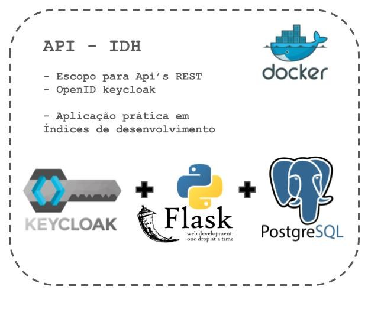

# Flask-Keycloak


Este projeto integra Flask com Keycloak para autenticação e autorização.

## Instalação

### Pré-requisitos
- Certifique-se de ter o Docker instalado em seu sistema.

### Passos para Instalar

1. **Clone o repositório:**
    ```bash
    git clone https://github.com/Deivison07/flask-keycloak.git
    ```

## Executando a Aplicação

1. **Navegue até o diretório do projeto:**
    ```bash
    cd flask-keycloak
    ```
2. **Construa e execute a aplicação usando Docker Compose:**
    ```bash
    docker-compose up --build
    ```

## Endpoints

### Endpoint de Autenticação
- **[POST]** `http://localhost:8080/realms/dev/protocol/openid-connect/token` (Obter Token)
  - **Parâmetros:**
    - `grant_type`: `password`
    - `client_id`: `flaskFront` (Previamente cadastrado no Keycloak)
    - `client_secret`: `mNBLRbrFqoFARqtTbGfR78AbSjm3ItQp` (Previamente cadastrado no Keycloak)
    - `username`: `henrique` (Previamente cadastrado no Keycloak)
    - `password`: `12345` (Previamente cadastrado no Keycloak)

### Endpoints da API
- **[GET]** `http://localhost:5000/indices`
- **[GET]** `http://localhost:5000/indices-mun`
- **[GET]** `http://localhost:5000/estagos`
- **[GET]** `http://localhost:5000/regioes`
- **[GET]** `http://localhost:5000/municipios`

## Contribuindo

Se você gostaria de contribuir para este projeto, siga estes passos:

1. Faça um fork do repositório.
2. Crie uma nova branch (`git checkout -b feature-branch`).
3. Commit suas alterações (`git commit -am 'Adicione uma nova funcionalidade'`).
4. Push para a branch (`git push origin feature-branch`).
5. Crie um novo Pull Request.

## Licença

Este projeto está licenciado sob a Licença MIT. Veja o arquivo [LICENSE](LICENSE) para mais detalhes.

## Contato

Se você tiver alguma dúvida ou sugestão, sinta-se à vontade para abrir uma issue ou entrar em contato com o proprietário do repositório.
